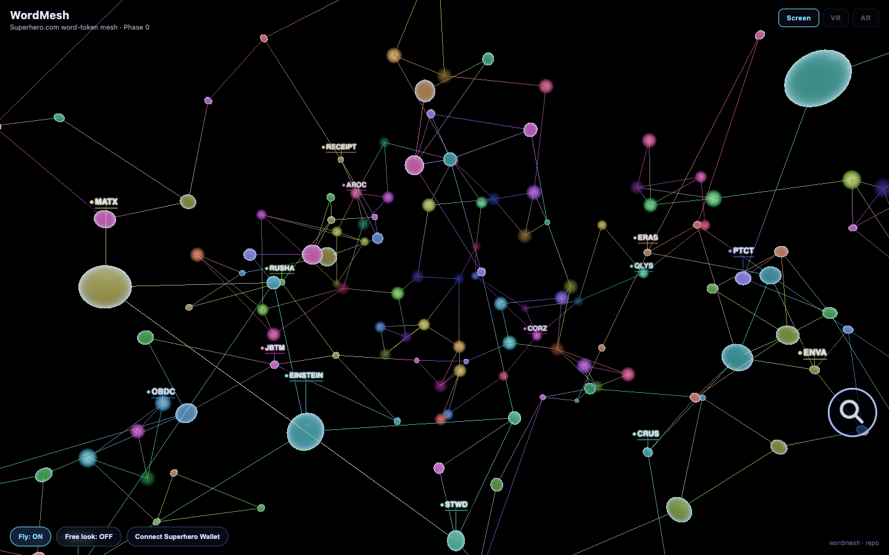
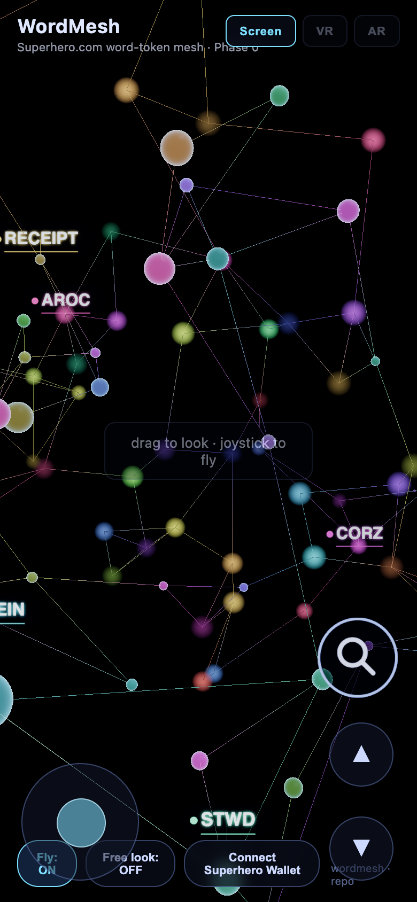
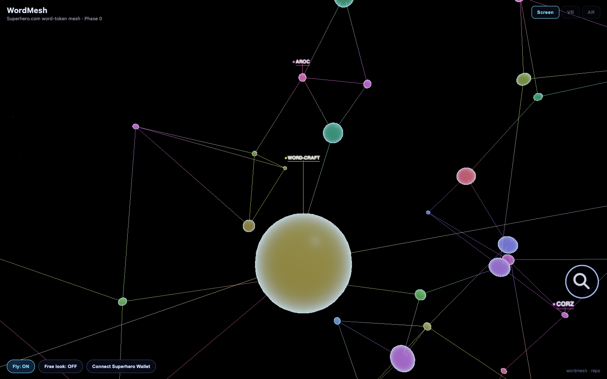
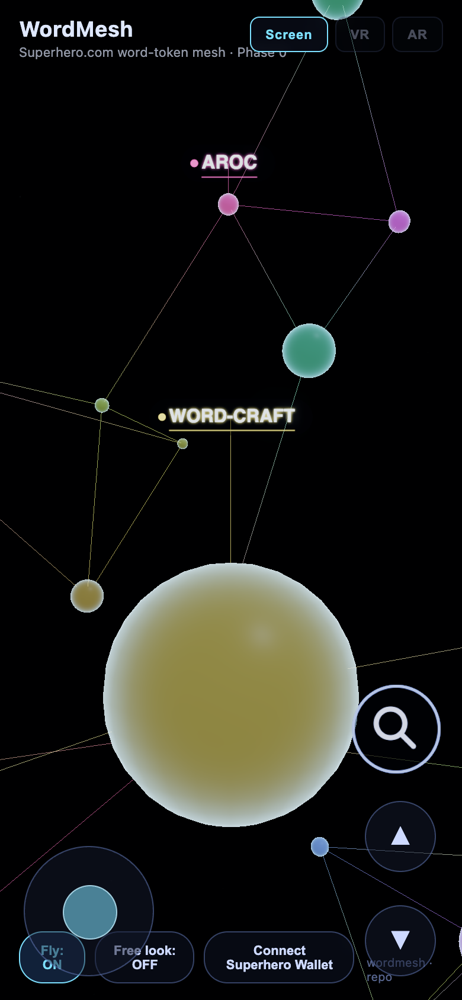
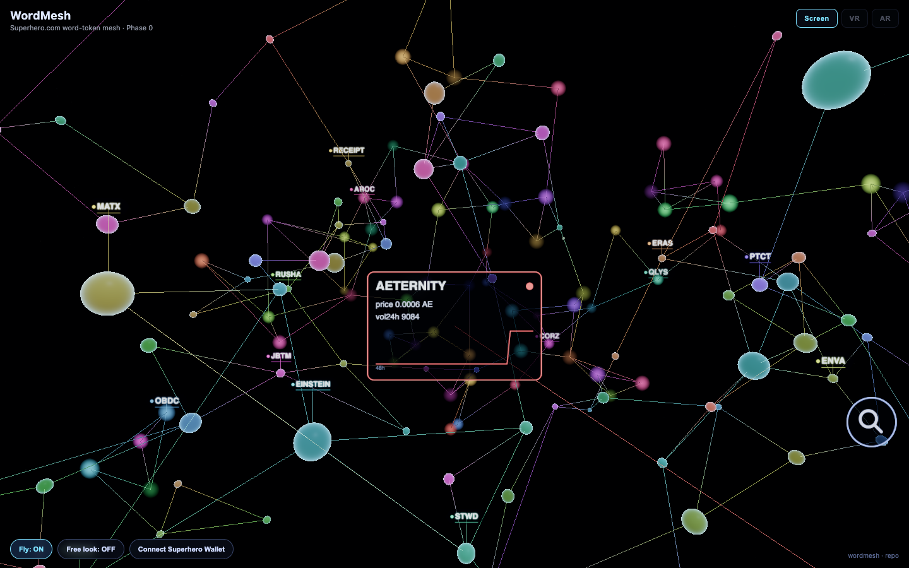
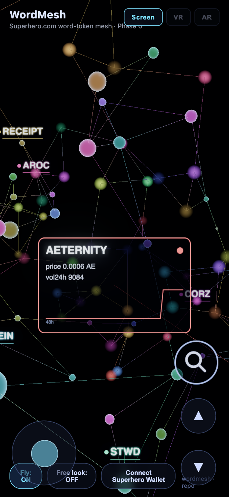
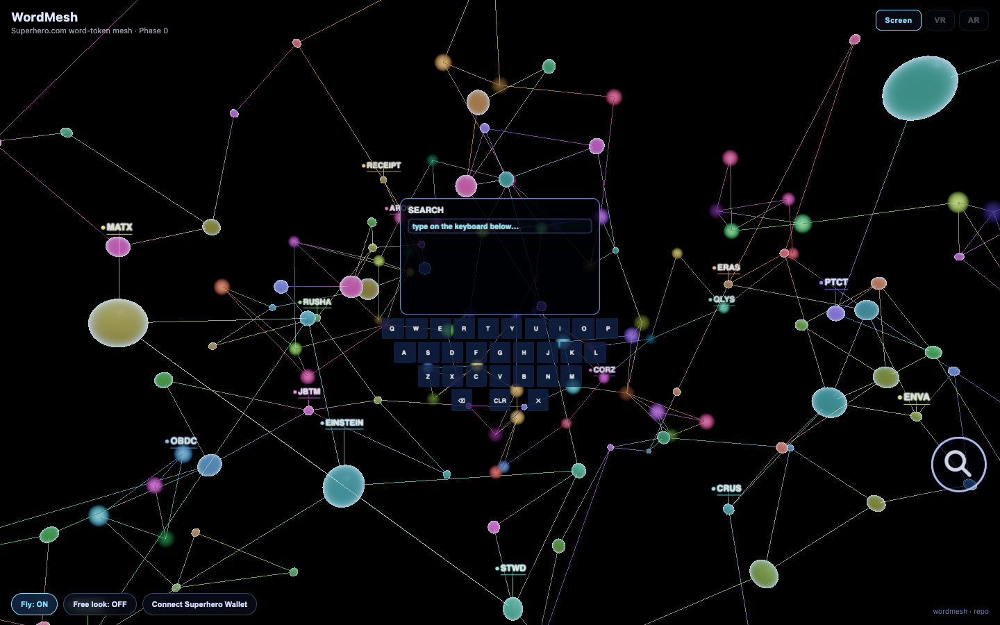
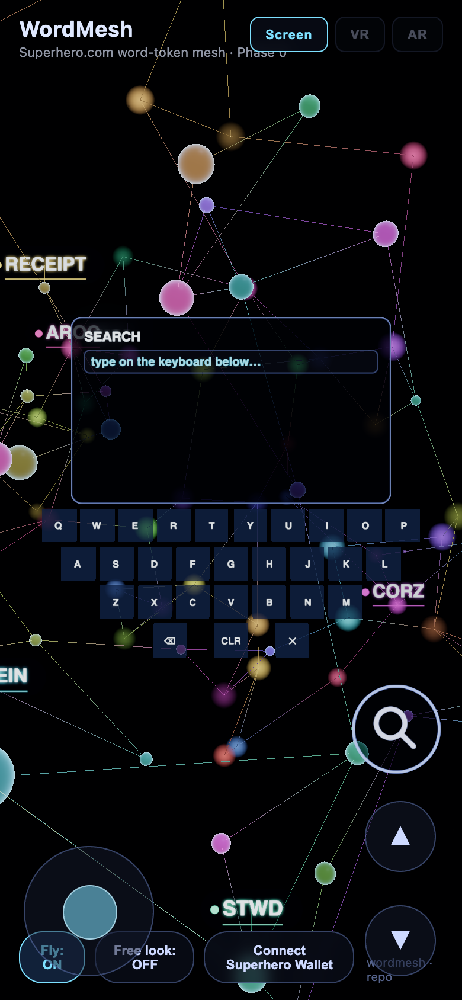

# WordMesh evidence index

Report source: one section per captured version, newest first. Automated captures come from
`npm run capture-evidence` (desktop 1440×900; mobile 390×844, Android UA). Real-device shots
are added by hand to each version's `DEVICE/` folder and listed here on the next capture run.
Evidence is never deployed (`evidence/` is in `.pages-exclude`).

<!-- evidence:sections -->

<!-- evidence:d8ffa07 -->
## d8ffa07 — 2026-09-14

- **sha:** `d8ffa0745b535992ad0bc65b88a59cef15fd306d`  ·  **captured:** 2026-09-14T12:01:37.145Z
- **changes:** Evidence capture pipeline — standard screenshots per version, committed, report-ready.

| scene | desktop 1440×900 | mobile 390×844 |
|---|---|---|
| overview-firstload |  |  |
| closeup-labels |  |  |
| detail-card-open |  |  |
| search-open |  |  |
| menu-open | _no menu in this build_ | |
| landmarks | _no landmarks in this build_ | |

**Device shots:** none yet — drop `quest-<scene>.jpg`, `iphone-<scene>.jpg`, `android-<scene>.jpg` into `d8ffa07/DEVICE/`
<!-- /evidence:d8ffa07 -->

<!-- evidence:pre-v1 -->
## pre-v1 — historical, unstructured

_No earlier screenshots existed locally when the pipeline was created (`verification/` was never committed). Nothing to seed._
<!-- /evidence:pre-v1 -->
